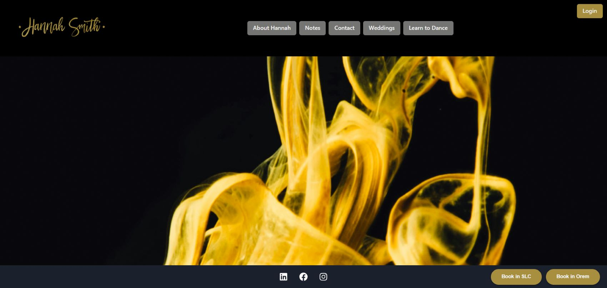

# Hannah Smith Ballroom

## Description
Welcome to the **Hannah Smith Ballroom** website application! This platform is designed to showcase ballroom dance instruction services, including private lessons for social dance, wedding first dances, and dance competitions. It is an interactive full-stack application, utilizing modern web technologies such as React, Chakra UI, Emailjs, Vite, and MongoDB.

## Table of Contents
* [Installation](#installation)
* [Usage](#usage)
* [License](#license)
* [Contributing](#contributing)
* [Tests](#tests)
* [Credits](#credits)
* [Questions](#questions)

## Installation
To use this application, you must have Node.js installed. Before running the application, install the necessary dependencies by typing `npm install` into the terminal.

## Usage
This site is deployed at https://hannahsmithballroom.com

Navigate through the sections using the navigation bar.
* **About Hannah**: Learn about Hannah's background, experience and dance philosophy.
* **Notes**: After the user creates a login, they can utilize this page to write notes after each dance lesson to remember what they learned.
* **Contact**: The user can visit Hannah's social media accounts by selecting the prospective icons, or they can simply send Hannah a message by filling out the contact form here.
* **Weddings**: A dropdown will appear. The user can view information about wedding dance lessons, book a lesson or view frequently asked questions.
* **Learn to Dance**: A dropdown will appear. The user can view information about social and competitive dance lessons, book a lesson or view frequently asked questions.

The user can also book lessons by selecting one of the widgets in the lower right-hand corner, depending on the user's preferred location.

## License
This project is licensed under the MIT license. Please feel free to read the license in full detail [here](https://opensource.org/license/mit)

## Contributing
Please contact [Hannah](https://github.com/hannahpsmith) regarding contributions to the repo.

## Tests
N/A

## Credits
Background Photo by <a href="https://unsplash.com/@chuttersnap?utm_content=creditCopyText&utm_medium=referral&utm_source=unsplash">CHUTTERSNAP</a> on <a href="https://unsplash.com/photos/photo-of-yellow-thread-8nMjIn195p0?utm_content=creditCopyText&utm_medium=referral&utm_source=unsplash">Unsplash</a>
  
Dancers in other images:
* Hannah Smith
* Enrique Blancas
* Michele Cozzens
* Kasey Butler
* Sunshine Barney
* Rachael Delamare
* Cody Miller

## Questions
For any questions, please contact us directly. Our GitHub accounts are listed below:

- [Hannah](https://github.com/hannahpsmith)
- [Travis](https://github.com/Travisgage)
- [Boden](https://github.com/Acid0000)
- [Mason](https://github.com/MrCows)
- [Eduardo](https://github.com/Massogon)